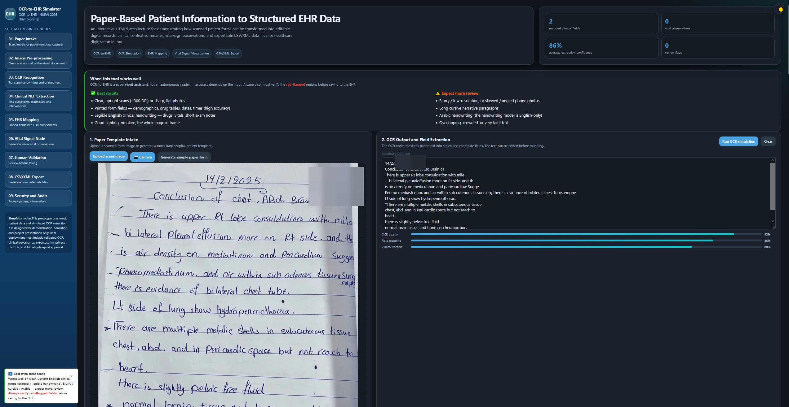

# OCR-to-EHR

Turning photos of handwritten Iraqi hospital charts into structured electronic health records.

Live demo: https://nurai.aisaracen.com

This is a showcase for a system we built for the NURAI 2026 championship at the American University of Baghdad. The code and the trained models are not in this repo (there's a note at the bottom about why), so this page just explains what we built, how it works, and how well it did.

## What it does

You take a photo of a paper hospital chart. The chart has printed labels in Arabic and English, with handwritten English notes next to them: drug names, doses, vital signs, findings. The system reads that photo and fills in structured EHR fields you can edit.

Every field it pulls out gets a confidence score. If the score is low, the field is not saved automatically; it goes to a human reviewer first. The whole point is that a wrong dose or a misread vital sign should never end up in the record without someone checking it.

  
   
  The tool reading a real chart. Patient identifiers were cropped out.

## Why it's hard

A few things make this awkward to solve:

- The charts mix scripts. Printed Arabic and English sit right next to English handwriting, and no single OCR engine reads all of that well.
- There is no public dataset of Iraqi doctors' handwriting to train on. We had to collect and label our own, which was slow going.
- It's medical data. Reading a number wrong and saving it quietly can hurt a patient, so decent accuracy on its own is not enough.

## How it works

Instead of throwing one big model at the whole page, we split the work up, send each piece to whatever tool handles it best, and then put a human check on top.

The pipeline goes like this:

1. Find the text regions on the page.
2. For each region, decide if it's printed or handwritten.
3. Send printed Arabic/English to PaddleOCR, and English handwriting to a TrOCR model we fine-tuned.
4. Rebuild the reading order so the output lines up with the page layout.
5. Pair each printed label with the handwritten value beside it.
6. Correct drug names against a formulary list.
7. Score each field. If the confidence is 0.90 or higher, accept it; otherwise send it to a supervisor.
8. Save the structured record. Whatever the supervisor corrects gets kept as new training data, so the model gets a little better each time.

## Results

Measured on public benchmarks and on our own labeled Iraqi chart lines:

| Metric | Value |
|---|---|
| Character accuracy (public handwriting benchmark) | 89.84% |
| Character error rate | 0.1016 |
| Character accuracy on real Iraqi handwriting | up to 64% |
| End-to-end field accuracy | around 88% |
| Usable after a light human review | around 97% |
| Mean confidence, correct vs wrong reads | about 0.96 vs 0.50 |
| Review threshold | 0.90 |

The useful part is the gap between the two confidence numbers. Correct reads sit around 0.96 and wrong ones around 0.50, so a single 0.90 cutoff catches almost every mistake and pushes it to review. That gap is really what makes the human-in-the-loop step work.

## Training

The handwriting model was trained in three stages, each one narrowing the focus a bit more:

1. Start from TrOCR, which is already pre-trained on IAM, a large public English handwriting set.
2. Adapt it on public medical and prescription handwriting so it picks up clinical vocabulary and styles.
3. Fine-tune on a small hand-labeled set of real Iraqi chart lines.

All of this ran on a single 6 GB consumer GPU (a GTX 1660). To fit in that little memory we used Adafactor, mixed precision, gradient checkpointing, and augmentation. The train/test split is based on a hash of each filename, which keeps the numbers comparable between runs.

## Tech stack

Machine learning: Python, PyTorch, Hugging Face Transformers, TrOCR (microsoft/trocr-base-handwritten), PaddleOCR, Adafactor.

Annotation: Label Studio.

Serving: Flask behind nginx, HTTPS through Let's Encrypt, running under systemd on a CPU-only Ubuntu VPS.

Training hardware: NVIDIA GTX 1660, 6 GB.

## Safety and data

The supervisor stays in control of anything the model isn't sure about, so no uncertain value gets written on its own. All personal identifiers were removed before processing, and the patient data was used with authorization. Handwriting recognition here is beta-level: it works, but it leans on the review step, and we say so plainly rather than overselling it.

## What it doesn't do yet

- Accuracy on real handwriting swings between training runs, because our in-domain labeled set is small and was hard to collect.
- Cursive, heavily abbreviated, and overlapping handwriting are still the worst cases.
- Arabic handwriting and very low-quality photos are not supported yet.
- Running on CPU only keeps it slow.

## Paper

There is a full write-up (English, with an Arabic abstract) that covers the problem, the datasets, the method, the results, deployment, and ethics. It was written for the NURAI 2026 championship. We are not putting it in this repo.

## Team

Built for the NURAI 2026 championship at the American University of Baghdad.

| Role | Name | Department |
|---|---|---|
| Supervisor | Abbas Khudhair AL-Zubaidi | Radiology and Sonar, College of Health Sciences |
| Author | Mujtaba Mohammed | Computer and AI, College of Engineering |
| Author | Fahad Amjed | Computer and AI, College of Engineering |
| Author | Farah Fawaz | Pharmacy, College of Pharmacy |

## Why the code isn't here

This repo is only a showcase. The source, the trained weights, and the data are kept private because the system handles medical data, it was built for a competition, and the models were trained on clinical material we can't release. This page documents the design and the results without shipping the implementation.

© 2026 the authors. OCR-to-EHR, NURAI 2026.
